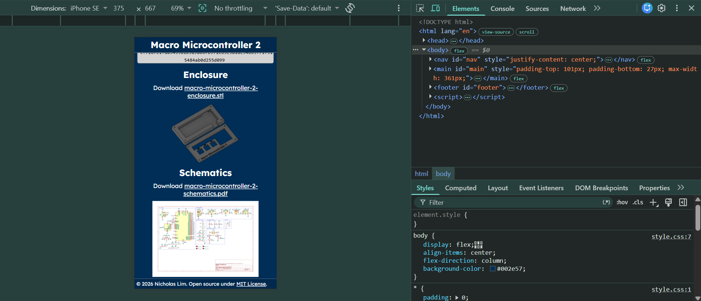

### Devlogs from <a href="https://stardance.hackclub.com/projects/21502">https://stardance.hackclub.com/projects/21502</a>

## Updated the firmware and ordered my PCB and parts!
### 3 July 2026, 2h 55m 43s
In this devlog, I've added a new function to my custom BASIC interpreter for my development board, and finally sent my PCB for manufacturing!

It took me quite a while to write the random number function that the old BASIC interpreters used to have: `RND`. I did many rounds of trial and error to finally create a working code (the previous code was returning either nothing or throwing compiler errors due to data types):
```c
printf("%f\n", (float)rand() / (float)RAND_MAX);
```
Here's a sample program you could run that generates a random number, stores it in a variable and prints it:
```basic
10 let x = rnd
20 lsvar
30 print rnd
```
Now, I'll be working on support for comments in my interpreter and wait for my parts to come. I can't wait to assemble my macropad + dev board!


## More updates to the documentation site!
### 24 June 2026, 1h 15m 23s
Today, I changed the layout and content of the documentation website and made it responsive for mobile devices! I initially wanted to add a 3D viewer to display the `.glb` file for rendering, but it did not output the result I wanted. (The silkscreen was not appearing!) I’ll read up on more about it, and hopefully, I would be able to add the 3D model into my documentation!



## Created a documentation site for my microcontroller!
### 23 June 2026, 2h 35m 8s
In this devlog, I improved the documentation of my project by creating a simple website to share specifications, schematics, and provide a direct link to download firmware and 3D print files. You may view it at <a href="https://nicholas1023.github.io/macro-microcontroller-2">https://nicholas1023.github.io/macro-microcontroller-2</a>!

### What I’ll be doing next
Next, I will be ordering the PCB and electronic components and finally solder them together!

<image src="Assets/Journal/macro-microcontroller-website.webp">

## Finished the enclosure and organised the repository!
### 20 June 2026, 3h 1m 11s
Today, I have completed the 3D case for Macro Controller 2 and did some minor bug fixes for the BASIC Interpreter. I needed to reassign the GPIO pins from the first revision of the board.

Although the interpreter is currently still basic, it supports 4 BASIC statements and 4 custom statements for controls.

### What’s new in this devlog
- Text and key labels for enclosure with cover
- Organised repository
- New `KEY` statement for hardware GPIO control

<b><a href="Assets/firmware-demo.mp4">Firmware demonstration video</a></b>

<image src="Assets/macro-microcontroller-2.png">
<image src="Assets/enclosure-image.png">

## Halfway through my PCB's case!
### 19 June 2026, 2h 4m 14s

### What I've done in this devlog
For the first-half, I added silkscreen text to the PCB for the IO components (GPIO Pins, Keyboard switches, LEDs...). Next, I moved on to designing the enclosure. It took a while for me to get used to using a new app to design it.

### Modifications to the PCB
- Added screw mounting pads for easier mounting.
- LEDs moved closer to each other for space to add silkscreen designs.

### Problems I've faced
The screw holes were not appearing during the first few attempts, but it worked in the end when I placed it manually, instead of using the move function.

Creating the cutout for the USB connector took me about 15 mins as I needed to measure the length and clearance needed for a micro-USB plug and create another sketch before extruding it as a cutout.

### What I'll be working on next
Next, I'll be continuing with the enclosure design, adding a cover with a keyboard plate, and finally moving on to the BASIC interpreter firmware for it!

<image src="Assets/macro-microcontroller-2.png">
<image src="Assets/Journal/enclosure 2026-06-19.png">

## Finished routing my microcontroller board!
### 19 June 2026, 2h 1m 39s

Did most of the routing for the MCU and macropad segment today, but I might need to do some rewiring for the flash memory as the trace length for `SD0` and `SD2` are very different (5.57 & 13.2 mm).

### What has been added since the last devlog
- Added power LED
- Added pin headers for GPIO and power
- Added barrel jack in case if the DC motor drains too much power

### What I'll be doing next
Next, I'll be adding more silkscreen text, and maybe design an icon for my macropad + microcontroller board. I'll also be creating a custom enclosure for my device!

<image src="Assets/Journal/PCB 2026-06-19.png">

## Finished the schematics and a little of the BASIC Interpreter for my microcontroller board! 
### 18 June 2026, 2h 22m 57s

### What I did today
- Redid the old schematics by adding custom RP2040 circuit instead of a using a dev board.
- Added new GPIO devices such as DC motor and a buzzer. (for the BASIC interpreter)
- Started on `PRINT`, `LET` and `INPUT` for the interpreter.

### What I'll be doing next
Next, I will be focusing on the BASIC interpreter firmware, working on variable assignment and math operations and testing it on a real pico board! Also, I will be starting on the layout and BOM as I have completed the schematics!

<image src="Assets/Journal/schematics 2026-06-18.png">
