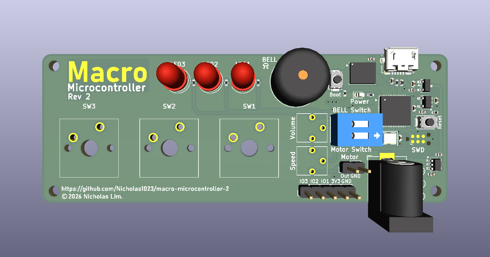
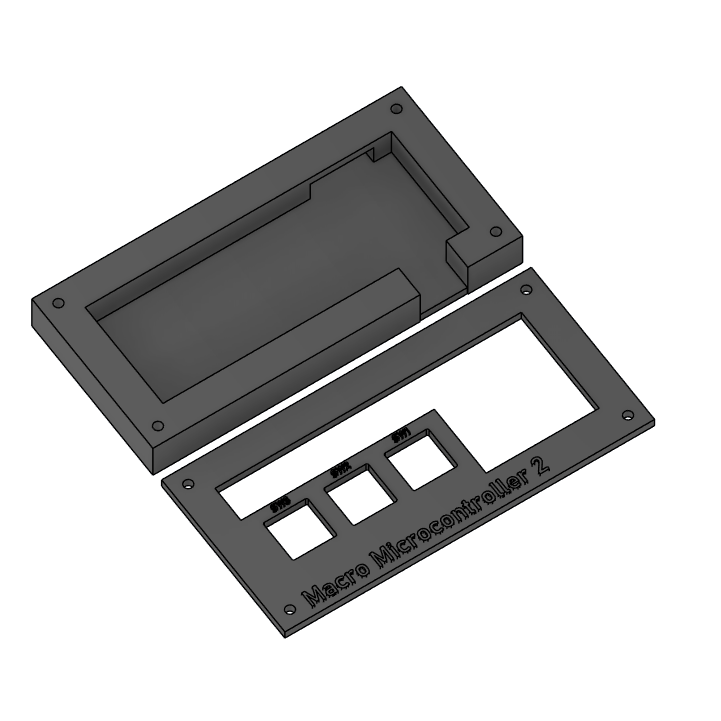
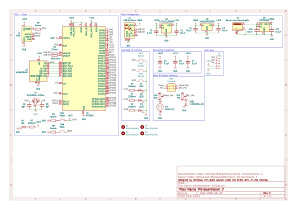

# Macro Microcontroller 2
A macropad and RP2040 microcontroller development board that allows you to control GPIOs with keyboard keys combined on a single PCB, with a custom BASIC interpreter.



## What's New?
1. Microcontroller unit directly soldered on board!
2. More output devices with speed and volume adjustments (Buzzer and motor).
3. More ways to power the board (Barrel jack, USB, GPIO pins).

## What Does it Do?
Macro Microcontroller 2 allows you to control GPIO pins using macropad-like keys and from the serial terminal using the built-in <a href="Firmware Files/macro-microcontroller-basic.c">Macro Microcontroller BASIC Interpreter</a>. It offers more ways to control GPIOs by having builtin keys that can be programmed to your own needs.

## Enclosure


## Macro Microcontroller BASIC Interpreter (Default Firmware)
A BASIC interpreter written in C for Macro Microcontroller, providing a simple coding environment via a serial terminal. You may view a demo at <a href="Assets/firmware-demo.mp4">Assets/firmware-demo.mp4</a>. Currently available statements:
1. `PRINT`: Outputs text to the serial terminal.
2. `LET`: Assigns a value (integer, float or string) to a variable (Only one variable is allowed for now).
3. `INPUT`: Assigns a value (integer, float or string) to a variable via user input.
4. `GPIO`: Turns on a specified GPIO pin for 1 second.
5. `LSVAR`: Outputs variable name and their value to the serial terminal.
6. `END`: Clears variable and reset line numbers.
7. `EXIT`: Puts the device into sleep/power off mode.
8. `KEY`: Pass GPIO controls to the macropad.

## Schematics


View PCB file at https://kicanvas.org/?repo=https%3A%2F%2Fgithub.com%2FNicholas1023%2Fmacro-microcontroller-2%2Fblob%2Fmain%2FPCB%20Files%2Fmacro-microcontroller-2.kicad_pcb!

## Repository Structure
```
main
 ├── /Assets ← Images and videos are here
 ├── /PCB Files ← .kicad_ files are here
 ├── /Production Files ← Gerber and BOM files are here
 ├── /Printing Files ← STLs are here
 ├── /Firmware Files ← Firmware files are here
 │     ├── macro-microcontroller-basic.c ← Firmware source file
 │     └── macro-microcontroller-basic.uf2 ← Compiled firmware
 │
 ├── README.md ← This file
 ├── LICENSE.txt ← License
 └── schematics.pdf ← Schematics
 ```

## Bill of Materials (Excluding Do Not Populate)
|Component|Ref Designator|Qty|Footprint|
|---------|--------------|---|---------|
|TMB12A24|BZ1|1|Buzzer_12x9.5RM7.6|
|Capacitor 0.1uF|C1, C2, C3, C4, C5, C6, C7, C10, C11|9|0402|
|Capacitor 8pF|C8, C9|2|0402|
|THT LED|D1, D2, D3|3|LED_D5.0mm|
|SMD LED|D4|1|0603|
|USB-B Micro Port|J1|1|USB_Micro-B_Molex_47346-0001|
|Barrel Jack|J3|1|BarrelJack_Horizontal|
|2.54 1x05 Pin|J4|1|PinHeader_1x05_P2.54mm_Vertical|
|2.54 1x02 Pin|M1|1|PinHeader_1x02_P2.54mm_Vertical|
|Resistor 27ohm|R1, R6|2|0402|
|Resistor 220ohm|R2, R4, R5, R7|4|0402|
|Resistor 5kohm|R3, R8|2|0402|
|Potentiometer|RV1, RV2|2|Potentiometer_Vishay_T73YP_Vertical|
|Cherry MX Keys|SW1, SW2, SW3|3|SW_Cherry_MX_1.00u_PCB|
|Reset & Boot Button|SW4, SW6|2|SW_Push_SPST_NO_Alps_SKRK|
|DIP Switch|SW5|1|SW_DIP_SPSTx02_Slide_9.78x7.26mm_W7.62mm_P2.54mm|
|RP2040|U1|1|QFN-56-1EP_7x7mm_P0.4mm_EP3.2x3.2mm|
|TLV71311PDBVR|U2|1|SOT-23-5|
|XC6206P332MR|U3|1|SOT-23-3|
|W25Q128JVP|U4|1|WSON-8-1EP_6x5mm_P1.27mm_EP3.4x4.3mm|
|TPS76350|U6|1|SOT-23-5|
|NX3225SA-12MHz|Y1|1|Crystal_SMD_3225-4Pin_3.2x2.5mm|
